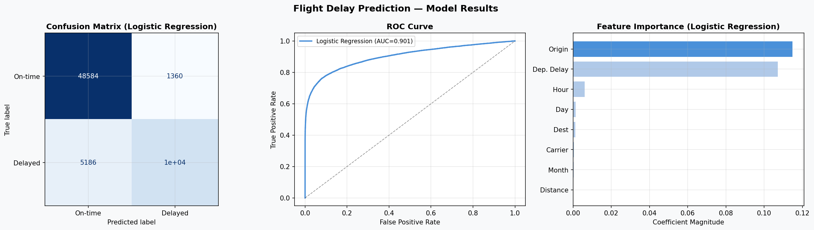
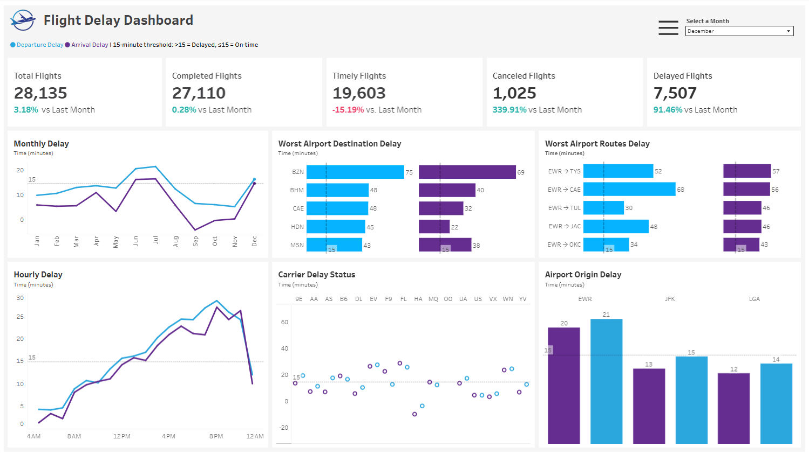
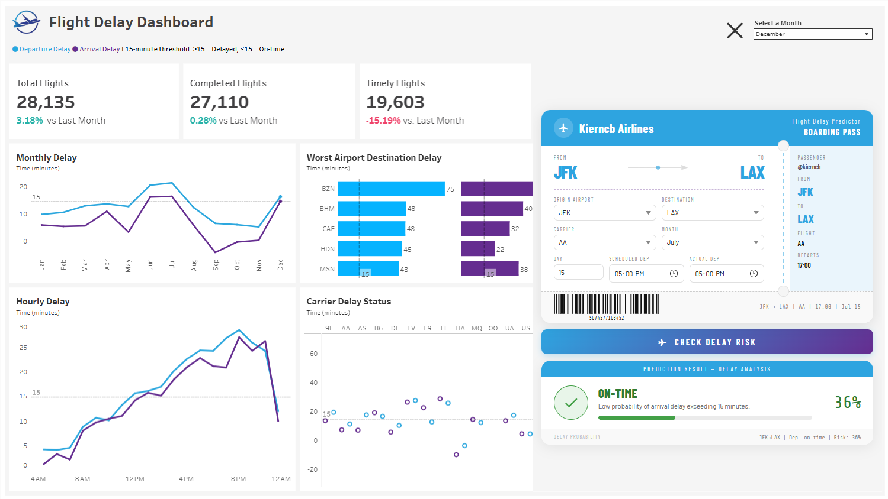

# Flight Delay Analysis: Uncovering and Predicting Delay Trends and Pattern

### Table of Contents

- [Executive Summary](#i-executive-summary)
- [Background](#ii-background)
- [Objectives](#iii-objectives)
- [Data Description](#iv-data-description)
- [Data Quality Check and Cleaning](#v-data-quality-check-and-cleaning)
- [Insight Deep-dive](#vi-insight-deep-dive)
- [Prediction Model](#vii-prediction-model)
- [Tableau Dashboard](#viii-tableau-dashboard)
- [Recommendations](#ix-recommendations)

## I. Executive Summary

This analysis reveals a strong positive correlation between departure and arrival delays, with no influence from flight distance. Airlines like Delta, JetBlue, and United perform efficiently despite high traffic, while ExpressJet, Frontier, and Mesa struggle with delays, suggesting operational challenges. Monthly trends show higher delays during peak travel periods (June–July, December), and hourly patterns highlight increased delays from 15:00 to 21:00, peaking between 19:00–21:00. Among the origin airports, EWR records the longest delays due to its high volume, while JFK and LGA demonstrate better efficiency. Notably, destinations like RIC and MKE consistently suffer from delays, indicating systemic issues.

To address these challenges, targeted improvements are recommended: optimize EWR operations, maintain JFK’s efficiency, and streamline LGA’s processes during peak hours. Addressing persistent delays at destinations like RIC and managing flight volumes during peak months can reduce congestion. Leveraging traffic data for better fleet and schedule management, especially during high-delay hours, can improve overall punctuality. Enhanced coordination between airports, airlines, and ground teams will be key in delivering a more efficient and reliable travel experience.

## II. Background

Flight delays are a significant issue in the aviation industry, affecting millions of passengers every year. These delays not only lead to frustration for travelers but also cause operational inefficiencies for airlines and airports. Understanding the factors that contribute to delays—such as airline performance, time of day, and airport conditions—can help improve punctuality and reduce the impact on passengers.

This analysis is crucial because it identifies patterns and trends that can help stakeholders, including airlines, airports, and passengers, make informed decisions. By uncovering the root causes of delays, airlines can optimize their operations, airports can improve traffic management, and passengers can better anticipate and plan for disruptions. This work is especially important as air travel continues to grow, and the demand for more efficient flight operations increases.

## III. Objectives
The primary goal of this project is to analyze flight delay data and uncover patterns related to airlines, airports, and time factors. The analysis will address the following key questions:

1. **Airline Performance**: How do different airlines compare in terms of their departure and arrival times? Are there noticeable trends in their on-time performance over the course of the year?
   
2. **Delays by Time**: Are there specific months, weeks, or times of the day where there is a general trend of greater delays across all carriers? What factors could contribute to these delays?

3. **Airport Performance**: How do different airports compare in terms of departure and arrival punctuality? What role do factors like location, traffic volume, and operational efficiency play in delays? Are there patterns in delays across various airports?

By answering these questions, the analysis will provide actionable insights into the operational challenges airlines and airports face, with a focus on identifying specific time periods and locations where improvements could reduce delays.

## IV. Data Description

The flight dataset consists of 21 columns and a total of 327,346 records, collected in 2013. The dataset is available [here](https://www.kaggle.com/datasets/mahoora00135/flights/data).

| Column Name       | Description                                                                 | Data Type   |
|-------------------|-----------------------------------------------------------------------------|-------------|
| id                | A unique identifier for each flight record                                  | Integer     |
| year              | The year in which the flight took place (2013)                              | Integer     |
| month             | The month of the flight (1 to 12)                                            | Integer     |
| day               | The day of the month of the flight (1 to 31)                                 | Integer     |
| dep_time          | Actual local departure time (hhmm, 24-hour format)                          | Integer     |
| sched_dep_time    | Scheduled local departure time (hhmm, 24-hour format)                       | Integer     |
| dep_delay         | Departure delay in minutes (positive = delayed, negative = early)           | Integer     |
| arr_time          | Actual local arrival time (hhmm, 24-hour format)                            | Integer     |
| sched_arr_time    | Scheduled local arrival time (hhmm, 24-hour format)                         | Integer     |
| arr_delay         | Arrival delay in minutes (positive = delayed, negative = early)             | Integer     |
| carrier           | Two-letter airline carrier code                                              | String      |
| flight            | Flight number                                                                | Integer     |
| tailnum           | Aircraft identifier                                                          | String      |
| origin            | Origin airport code (e.g., JFK, LGA, EWR)                                    | String      |
| dest              | Destination airport code                                                     | String      |
| air_time          | Duration of the flight in minutes                                            | Integer     |
| distance          | Distance between airports in miles                                           | Integer     |
| hour              | Hour component of the scheduled departure time                               | Integer     |
| minute            | Minute component of the scheduled departure time                             | Integer     |
| time_hour         | Scheduled departure timestamp (YYYY-MM-DD HH:MM:SS)                         | Datetime    |
| name              | Name of the airline carrier                                                  | String      |

## V. Data Quality Check and Cleaning

### Data Quality Check

I checked the dataset’s quality by first looking at a preview using `df.head()` and making sure all columns were visible. I then looked at the unique values in each column with `df.nunique()` and checked the data types using `df.dtypes`. I looked for duplicates using `df.duplicated().sum()` and checked for missing values with `df.isnull().sum()`, focusing on columns with missing data. This helped me find problems like missing values, duplicates, and wrong data types, making sure the data is reliable before cleaning.

### Data Cleaning

I cleaned the dataset by first removing rows with missing values using `df.dropna()`. Then, I converted the month numbers to their corresponding names using a mapping dictionary. I also standardized the time columns (`'dep_time'`, `'sched_dep_time'`, `'arr_time'`, and `'sched_arr_time'`) to a consistent `HHMM` format and handled the 2400 values appropriately. Lastly, I converted the `'dep_delay'`, `'arr_delay'`, and `'air_time'` columns from float to integer to ensure consistency. These steps helped prepare the dataset for analysis.

## VI. Insight Deep-dive
### Relationship Between Departure and Arrival Delays Based on Flight Distance

- The scatter plot shows a strong positive correlation between departure and arrival delays—flights that depart late tend to arrive late, while early departures often lead to early arrivals
- There are some extreme outliers with very high delays. These may represent exceptional cases, like weather disruptions or technical issues.
- Flight distance shows no significant correlation with delays; both short-haul and long-haul flights follow a similar pattern—arrival delays increase with departure delays, and early departures often lead to early arrivals.

### Impact of Traffic Volume on Departure and Arrival Delays by Airline

- Despite their high flight volumes, Delta Air Lines Inc (14.56%), JetBlue Airways (16.51%), and United Air Lines Inc (17.65%) maintain delays under 15 minutes, reflecting efficient operations and effective fleet management.
- ExpressJet Airlines with 15.61% volume has the highest delays, averaging around 19 minutes, which may indicate operational challenges or congestion.
- Airlines with lower flight volumes, such as Hawaiian Airlines Inc (0.1%) and Alaska Airlines (0.22%), typically experience shorter delays, possibly due to fewer flights, better scheduling, or less congestion.
- In contrast, airlines like Frontier Airlines Inc (0.21%), Mesa Airlines (0.22%), and AirTan Airways (0.97%) face significant delays, averaging over 18 to 20 minutes, which could suggest inefficiencies or higher operational pressure despite their lower flight volume.
- Endeavor Air (5.28%) and Southwest Airlines (3.68%) have medium flight volumes, with delays ranging from 16 to 17 minutes, suggesting moderate operational strain or capacity issues.
- US Airways (6.06%), Envoy Air (7.65%), and American Airlines (9.76%) maintain medium flight volumes but manage to keep delays under 15 minutes, demonstrating good scheduling and timely operations despite the moderate number of flights.

### Monthly Average of Departure and Arrival Delays

- **January to May**: With lower delays (9-13 minutes for departures), operations were more efficient, likely due to lower flight volumes or better management.
- **June to July**: The increase in departure delays (20-21 minutes) suggests higher flight volumes or greater operational challenges, leading to less efficient performance.
- **August to November**: As delays decreased (from 12 minutes to 5 minutes for departures), it likely indicates a reduction in flight volumes or improved operations, allowing for better management of delays.
- **December**: The rise in delays (15-16 minutes for departures) suggests a potential increase in flight volumes or operational strain as the year ended, leading to higher delays.

### Hourly Average of Departure and Arrival Delays

- **5:00 to 14:00**: Departure delays range from 41 seconds to 13 minutes 42 seconds, which is good and manageable. The relatively low delays during this time suggest lower traffic volumes, allowing for smoother operations and efficient management of flights.
- **15:00 to 21:00**: Delays increase to 16 to 24 minutes, with the peak at 19:00 to 21:00 showing consistent 24-minute delays. This period likely experiences higher traffic volumes, contributing to longer delays. The congestion during peak hours may lead to operational strain and inefficiencies.
- **22:00 to 23:00**: Delays decrease from 18 minutes to 14 minutes, indicating an improvement likely due to reduced traffic volumes and fewer operational pressures. This suggests better handling of delays as the evening progresses and the number of flights decreases.

### Impact of Flight Volume on Departure and Arrival Delays by Origin

- Flight Volume: EWR is the busiest with 35.78% of total flights, followed by JFK at 33.32%, and LGA at 30.9%.
- Departure Delay: EWR has the longest departure delay (15m 1s), followed by JFK at 12m 1s, and LGA at 10m 17s. The higher flight volume at EWR correlates with longer delays.
- Arrival Delay: EWR also has the longest arrival delay (9m 6s), while JFK (5m 33s) and LGA (5m 47s) have shorter delays.
- EWR, being the busiest airport, experiences the longest delays, both for departures and arrivals, likely due to the high traffic and operational strain.
- JFK has a significant volume of flights but operates more efficiently than EWR, with relatively shorter delays in both departure and arrival.
- With the least flight volume, LGA handles its operations more smoothly, resulting in the shortest delays overall. This could indicate well-managed operations with a focus on efficiency.

### Average Departure Delay for Each Origin Airport

- **EWR has the worst performance**

    - 58.8% of its destination flights experience delays of over 15 minutes — the highest among the three.
    - It also has the widest delay range: 15m 8s to 41m 39s, suggesting not only frequent but also longer delays.
    - EWR may be facing operational inefficiencies, congestion, or weather-related issues that significantly affect downstream schedules.

    

-  **LGA shows moderate performance**

    - 33.8% of flights from LGA are delayed by more than 15 minutes at the destination — almost half of EWR’s percentage.
    - Delay range: 15m 11s – 31m 20s, suggesting delays are present but not as extreme as EWR.
    - LGA performs better than EWR but still has room for improvement in controlling moderate delays.

    

- **JFK has the best overall performance**

    - Only 31.4% of its flights result in delays over 15 minutes at the destination — the lowest percentage.
    - Delay range: 15m 12s – 27m 20s, indicating shorter and more consistent delays.
    - JFK demonstrates relatively efficient operations and better schedule adherence compared to the other two.

    

### Common Airport Destinations with >15 min Departure Delay Across All Airport Origins

- RIC, MKE, IAD, and ORF are consistent pain points across all origin airports, acting as delay magnets regardless of where flights depart.
- RIC stands out with the highest departure delay (23m 37s) and arrival delay (20m 7s), hinting at persistent operational or airspace inefficiencies.
- While MKE, IAD, and ORF have slightly shorter delays, their repeated presence signals underlying systemic issues, possibly from constrained capacity or coordination gaps on the receiving end.

See source code here: [flight_delay_analysis](analysis/Flight_Delay_Analysis.ipynb)

## VII. Prediction Model

A Logistic Regression model was built to predict whether a flight will arrive more than 15 minutes late (`arr_delay > 15`).

**Features used:** `month`, `day`, `hour`, `dep_delay`, `distance`, `carrier`, `origin`, `dest`

**Process:**
- Target variable `is_delayed` was encoded as binary (1 = delayed, 0 = on-time)
- Categorical features were label-encoded
- Data split 80/20 (train/test, stratified)
- Model evaluated using ROC-AUC, confusion matrix, and classification report

**Results:**

| Metric           | Score  |
|------------------|--------|
| ROC-AUC          | 0.9015 |
| Overall Accuracy | 90%    |
| Delayed Precision| 88%    |
| Delayed Recall   | 67%    |
| Delayed F1-Score | 0.76   |

**Key finding:** The model performs strongly at identifying on-time flights (F1 = 0.94) but is 
more conservative with delayed flights (F1 = 0.76), meaning some delays go undetected. 
Departure delay was the strongest predictor of arrival delay.

**Output:** The trained model was exported as `flight_model.pkl` and supports single-flight 
predictions via `predict_flight()`, returning a delay probability and On-time/Delayed label.

See prediction models here: [model_training](analysis/flight_delay_prediction.ipynb),  [model_trained](analysis/flight_model.pkl)

## VIII. Tableau Dashboard

See Tableau dashboard [here](https://public.tableau.com/views/Try_17529228321370/Page_1?:language=en-US&publish=yes&:sid=&:redirect=auth&:display_count=n&:origin=viz_share_link).

## IX. Recommendations

- **Improve Operations at EWR**
    - To address EWR’s significant delays—15 minutes for departures and 9 minutes for arrivals—airport management and operations teams should focus on reducing congestion and better handling weather disruptions. With the airport handling over a third of the total flight volume, these delays compound quickly. Strategies include adjusting flight schedules to reduce peak-hour pressure, improving air traffic coordination, strengthening communication with airlines, and enhancing weather-related response protocols.

- **Reduce Delays at LGA**  
    - At LGA, 33.8% of flights are delayed by more than 15 minutes. To improve, airport management and airlines should upgrade delay management systems. Streamlining the boarding process, boosting staff capacity during busy times, and enhancing coordination between air and ground teams can help improve efficiency and reduce disruptions.

- **Maintain Efficiency at JFK**  
    - JFK has relatively low delay rates, with only 31.4% of flights delayed over 15 minutes. To keep this performance, airport management should maintain current practices and invest in predictive scheduling tools and real-time data systems. These steps will help JFK continue delivering reliable service while managing high traffic volumes.

- **Address Recurring Delays at RIC, MKE, IAD, and ORF**  
  - Airports like RIC, MKE, IAD, and ORF show recurring delays, with RIC standing out at over 23 minutes for departures. Authorities at these airports need to investigate the causes, such as airspace congestion or infrastructure limitations. Improvements in air traffic management, infrastructure upgrades, and tighter coordination with airlines are necessary to reduce inefficiencies.

- **Manage Peak Season Flight Volume**  
  - Flight volumes increase significantly in June, July, and December, contributing to more delays. Airport managers, airlines, and scheduling teams should adjust flight schedules to avoid peak-hour clustering. Enhancing queuing systems and baggage handling during these months can help maintain smoother operations and better passenger flow.

- **Use Traffic Data to Optimize Fleet Scheduling**  
  - Airlines like Delta and JetBlue, which manage high volumes yet maintain lower delays, show that effective fleet management works. Airline fleet teams should use traffic data insights to improve scheduling. Those with lower traffic should explore scalable fleet strategies that maintain efficiency as demand grows.

- **Monitor and Adjust for Time-of-Day Delays**  
  - Delays spike between 3 PM and 9 PM, peaking at 24 minutes between 7 PM and 9 PM. Airport operations and airline schedulers should respond by adding staff during these hours and adjusting departure times to reduce bottlenecks. These changes can significantly ease congestion during peak hours.

- **Strengthen Coordination Across Stakeholders**  
  - At busy airports like EWR, JFK, and LGA, better collaboration between airport authorities, airlines, and ground handling teams is key. Establishing joint task forces, improving data sharing, and coordinating operations like gate assignments and baggage handling can reduce delays and streamline overall airport performance.
 
By focusing on airport-specific issues, adjusting to seasonal and hourly flight patterns, and promoting better coordination across the industry, delays can be reduced, operations can become more efficient, and the overall travel experience can be improved for passengers.
